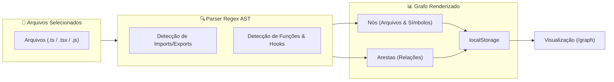
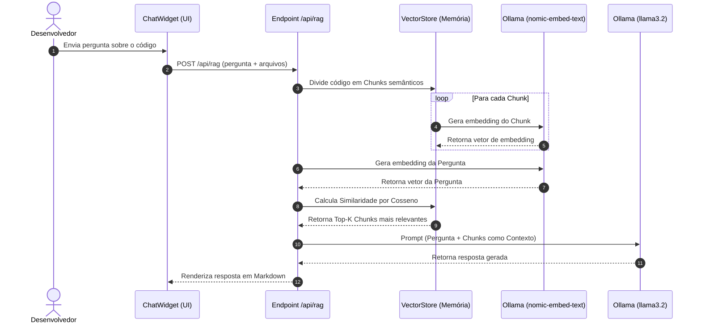
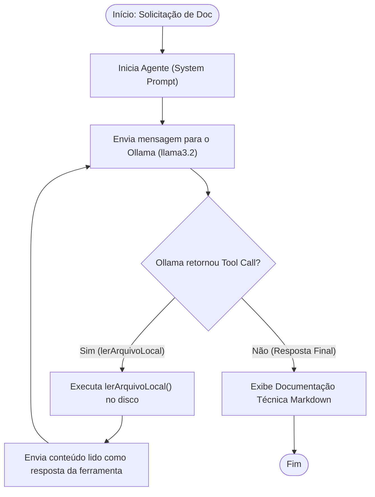
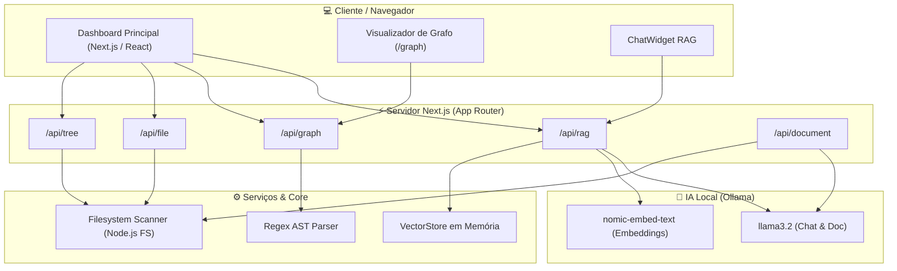

# RepoContext

> Ferramenta inteligente e autônoma para preparação, análise de dependências e otimização de contexto de repositórios de código para modelos de linguagem (LLMs).

[](https://nextjs.org/)
[](https://reactjs.org/)
[](https://www.typescriptlang.org/)
[](https://tailwindcss.com/)
[](https://ollama.ai/)
[](LICENSE)

---

## 🎯 Visão Geral

O **RepoContext** é uma plataforma desenvolvida para engenheiros de software e equipes de desenvolvimento que necessitam otimizar o envio de código-fonte para modelos de linguagem (LLMs) como ChatGPT, Claude, Gemini, DeepSeek e agentes locais.

Através de uma interface web intuitiva e APIs de alta performance, a aplicação permite abrir qualquer repositório local, navegar por sua árvore de arquivos, selecionar módulos de interesse e gerar automaticamente um prompt perfeitamente estruturado. Além da otimização de tokens, o **RepoContext** conta com **mapa visual de dependências (Code Graph)**, **busca semântica local via RAG (Retrieval-Augmented Generation)** com suporte a embeddings, e um **agente de IA autônomo baseado em Ollama** para geração de documentação técnica.

---

## 🔍 Problema Resolvido

Ao utilizar LLMs para auxiliar no desenvolvimento de software, desenvolvedores frequentemente enfrentam diversos entraves:

- ❌ **Custo e estouro de contexto**: Copiar arquivos inteiros consome rapidamente a janela de contexto da IA.
- ❌ **Trabalho manual e repetitivo**: Copiar e colar dezenas de arquivos individualmente gera perda de tempo.
- ❌ **Falta de visibilidade de dependências**: LLMs falham ao entender a relação entre componentes, hooks e utilitários importados sem o mapa do projeto.
- ❌ **Privacidade de código**: Enviar repositórios inteiros para nuvens de terceiros traz riscos de vazamento de propriedade intelectual.
- ❌ **Ruído de comentários e formatação**: Espaços extras e comentários em bloco inflam o consumo de tokens sem agregar valor ao modelo.

**O RepoContext resolve todos esses desafios em uma única ferramenta 100% local!** 🚀

---

## ✨ Funcionalidades Principais

### 🗂️ 1. Explorador de Arquivos & Escaneamento Inteligente
- **Scan Local Recursivo**: Escaneia qualquer repositório informando o caminho absoluto do sistema de arquivos.
- **Filtro Automático de Ignora**: Oculta automaticamente diretórios e arquivos pesados/irrelevantes (`node_modules`, `.git`, `.next`, `dist`, `__pycache__`, `.venv`, etc.).
- **Navegação Dinâmica**: Árvore interativa com busca em tempo real por nome ou extensão de arquivo.
- **Seleção em Massa**: Selecione ou desmarque pastas inteiras ou a árvore inteira com um único clique.
- **Tabs de Diretórios Raiz**: Facilita a alternância de contexto entre múltiplos módulos do projeto.

---

### 📝 2. Gerador & Otimizador de Prompts
- **Modo Normal**: Preserva a sintaxe e formatação original dos arquivos selecionados.
- **Modo Otimizado (Token Saver)**: Remove automaticamente comentários de código (linha única e bloco) e reduz linhas em branco desnecessárias, economizando até 40% dos tokens.
- **Métricas e Estatísticas em Tempo Real**:
  - Contagem total de arquivos e caracteres.
  - Estimativa de tokens consumidos.
  - Cálculo percentual e absoluto de tokens economizados no modo otimizado.
- **Cópia Rápida para o Clipboard**: Botão de cópia instantânea com fallback automático para ambientes sem suporte nativo a HTTPS (`navigator.clipboard`).

---

### 🔗 3. Code Graph (Grafo de Dependências de Código)
- **Análise Estática via AST Regex-based**: Analisa o código-fonte selecionado identificando funções, componentes React, custom hooks, classes, declarações de `import`/`export` e chamadas de função.
- **Grafo Interativo Integrado**: Exibe nós (arquivos e símbolos) e arestas (dependências e chamadas) diretamente na interface.
- **Modo Tela Cheia (`/graph`)**: Página dedicada em tela cheia para explorar visualmente a arquitetura do projeto.
- **Persistência de Dados**: Grafo salvo em `localStorage` para rápido acesso entre sessões.

#### Fluxo de Análise do Code Graph


---

### 🧠 4. Busca Semântica & Chat RAG (Retrieval-Augmented Generation)
- **Chunking Inteligente de Código**: Divisão dos arquivos em pedaços (chunks) preservando contextos semânticos de funções e blocos.
- **Embeddings 100% Locais**: Geração de vetores semânticos através da API local do Ollama utilizando o modelo `nomic-embed-text`.
- **Motor de Similaridade por Cosseno**: Cálculo matemático em tempo real para ranquear os trechos de código mais relevantes para cada pergunta do usuário.
- **Vector Store em Memória**: Indexação rápida sem necessidade de bancos de dados vetoriais externos.
- **ChatWidget Interativo**: Widget flutuante integrado à página para tirar dúvidas, pedir refatorações e solicitar explicações diretamente com a IA baseada no contexto do código selecionado.

#### Diagrama de Sequência do RAG


---

### 🤖 5. Agente Autônomo de Documentação Técnica
- **Tool Calling com Ollama**: O agente utiliza ferramentas locais (`lerArquivoLocal`) para inspecionar arquivos sob demanda antes de escrever a documentação.
- **Execução em Linha de Comando (CLI)**: Utilitário interativo via terminal (`npm run dev:doc-agent`).
- **Endpoint HTTP dedicado**: API para acionar a geração de documentação de arquivos específicos via requisição HTTP.
- **Padrão Técnico de Documentação**: Gera estruturas organizadas em Markdown cobrindo propósito do módulo, assinaturas de funções, parâmetros, retornos e exemplos práticos.

#### Fluxo de Execução do Agente de Documentação (Tool Calling)


---

## 🏗️ Arquitetura do Sistema



### Tecnologias Utilizadas

#### Frontend
- **React 19.2.4**: Biblioteca para construção de interfaces reativas.
- **Next.js 16.2.6 (App Router)**: Framework React full-stack.
- **TailwindCSS 4.3.0**: Estilização moderna e responsiva em modo escuro.
- **Lucide React**: Biblioteca de ícones vetoriais.
- **React Markdown & Remark GFM**: Renderização de conteúdo Markdown no Chat e na Documentação.

#### Backend & Core
- **Node.js (v18+)**: Runtime de execução JavaScript/TypeScript.
- **TypeScript 5.0**: Tipagem estática para robustez do código.
- **FS Native (Node.js)**: Serviço de leitura e escaneamento do sistema de arquivos local.

#### Inteligência Artificial Local
- **Ollama**: Motor local para execução de LLMs sem dependência de nuvem.
- **LLM Principal**: `llama3.2` (para chat, RAG e documentação técnica).
- **Embedding Model**: `nomic-embed-text` (para geração de vetores semânticos no RAG).

---

## 📂 Estrutura do Projeto

```
repo-context/
├── src/
│   ├── agents/                          # Agentes de IA Autônomos
│   │   ├── documentation/               # Agente de Documentação Técnica
│   │   │   ├── index.ts                 # CLI do Agente (readline)
│   │   │   ├── prompt.ts                # System prompt do agente
│   │   │   └── tools.ts                 # Definição e execução de ferramentas (lerArquivoLocal)
│   │   ├── graph/                       # Agente & Parser do Code Graph
│   │   │   ├── prompt.ts                # Prompts para análise arquitetural
│   │   │   └── tools.ts                 # Extrator AST (Regex) de funções, componentes e imports
│   │   └── shared/                      # Recursos compartilhados entre agentes
│   │       ├── providers/
│   │       │   └── ollama.ts            # Cliente HTTP para comunicação com a API do Ollama
│   │       └── types/                   # Tipos de mensagens e parâmetros do Ollama
│   ├── app/                             # Next.js App Router (Rotas e Páginas)
│   │   ├── api/                         # Endpoints REST da aplicação
│   │   │   ├── document/                # POST /api/document - Geração de doc via IA
│   │   │   ├── file/                    # POST /api/file - Leitura de conteúdo de arquivo
│   │   │   ├── graph/                   # POST /api/graph - Análise de dependências e grafo
│   │   │   ├── rag/                     # POST /api/rag - Processamento RAG (indexação e chat)
│   │   │   ├── test-embedding/          # POST /api/test-embedding - Teste de geração de vetor
│   │   │   └── tree/                    # POST /api/tree - Escaneamento do diretório local
│   │   ├── graph/                       # Rota da aplicação web
│   │   │   └── page.tsx                 # Visualização em Tela Cheia do Code Graph
│   │   ├── globals.css                  # Estilos globais TailwindCSS
│   │   ├── layout.tsx                   # Layout raiz da aplicação
│   │   └── page.tsx                     # Dashboard principal (Explorer, Preview & Chat)
│   ├── features/                        # Módulos por Domínio de Funcionalidade
│   │   ├── code-graph/                  # Componentes e hooks do Grafo de Código
│   │   │   ├── components/              # GraphPanel.tsx e GraphView.tsx
│   │   │   └── hooks/                   # useCodeGraph.ts
│   │   ├── documentation/               # Componentes e hooks de Documentação
│   │   │   ├── components/              # DocumentationPanel.tsx
│   │   │   └── hooks/                   # useDocumentation.ts
│   │   ├── file-explorer/               # Explorador de Arquivos
│   │   │   ├── components/              # FileExplorer, FileTree, FolderTabs, SearchBar
│   │   │   └── hooks/                   # useFileExplorer.ts
│   │   ├── prompt-preview/              # Preview e Estatísticas de Tokens
│   │   │   ├── components/              # PromptPreview, PromptStats, SavingsStats, CopyButton, Toggle
│   │   │   └── hooks/                   # usePromptPreview.ts
│   │   └── rag/                         # Chat Interativo e RAG
│   │       ├── components/              # ChatWidget.tsx
│   │       └── hooks/                   # useRagChat.ts
│   ├── services/                        # Serviços da Aplicação
│   │   ├── filesystem.ts                # Escaneamento recursivo e leitura no SO
│   │   └── rag/                         # Motores do RAG
│   │       ├── chunking.ts              # Divisão semântica de textos de código
│   │       ├── embeddings.ts            # Chamada ao modelo nomic-embed-text
│   │       ├── similarity.ts            # Algoritmo de Similaridade por Cosseno
│   │       └── vectorStore.ts           # Banco vetorial em memória
│   ├── types/                           # Definições de Tipos TypeScript
│   │   └── fileNode.ts                  # Interface de nó de arquivo e lista de pastas ignoradas
│   └── utils/                           # Funções Utilitárias e Helpers
│       ├── buildTree.ts                 # Montagem de estrutura de árvore
│       ├── calculateSavings.ts          # Algoritmo de cálculo de tokens economizados
│       ├── generatePrompt.ts            # Formatação do prompt final para a IA
│       ├── generateStats.ts             # Estimador de tokens e tamanho de texto
│       ├── processFiles.ts              # Utilitário para sanitização/otimização de código
│       └── treeToText.ts                # Conversor de árvore para representação textual
├── .gitignore
├── eslint.config.mjs                    # Linting do projeto
├── next.config.ts                       # Configurações do Next.js (IPs e Rede Local)
├── package.json                         # Dependências e scripts do Node.js
├── postcss.config.mjs
├── prettier.config.mjs
├── readme.md                            # Documentação principal
└── tsconfig.json                        # Configuração do compilador TypeScript
```

---

## 🚀 Começando

### Pré-requisitos

- **Node.js**: Versão 18.17.0 ou superior.
- **npm**, **yarn** ou **pnpm**.
- **(Recomendado) Ollama**: Para utilizar a geração de documentação, o Chat RAG e os embeddings locais.

### Instalação

```bash
# Clone o repositório
git clone https://github.com/thiagoeu/repo-context.git
cd repo-context

# Instale as dependências
npm install
```

### Configuração do Ollama (IA Local)

1. Baixe e instale o Ollama em [ollama.ai](https://ollama.ai).
2. Baixe os modelos necessários:
   ```bash
   # Modelo de LLM para chat e documentação
   ollama pull llama3.2

   # Modelo de Embedding para busca semântica no RAG
   ollama pull nomic-embed-text
   ```
3. Garanta que o serviço do Ollama esteja rodando:
   ```bash
   ollama serve
   ```

### Executando a Aplicação Web

Para iniciar o servidor de desenvolvimento (configurado por padrão na porta `3190` e liberado para conexões locais de rede):

```bash
npm run dev
```

Acesse a aplicação no navegador em:
- **Local**: `http://localhost:3190`
- **Rede Local**: `http://<SEU_IP_LOCAL>:3190`

---

## 📖 Guia de Uso

### 1. Escaneando um Repositório
1. Na barra superior da aplicação, digite ou cole o caminho absoluto da pasta do repositório no seu computador (ex: `C:\workspace\meu-projeto` ou `/home/usuario/meu-projeto`).
2. Clique no botão **Escanear**.
3. A árvore de arquivos será carregada automaticamente no painel esquerdo.

### 2. Selecionando Arquivos e Gerando o Prompt
1. Navegue pela árvore ou use a barra de busca para localizar arquivos.
2. Marque as caixas de seleção dos arquivos ou pastas que deseja incluir no contexto da IA.
3. No painel direito, selecione a aba **Prompt Preview**.
4. Alterne entre o **Modo Normal** e o **Modo Otimizado** para verificar a economia de tokens.
5. Clique em **Copiar Prompt** para enviar o conteúdo formatado à sua IA de preferência.

### 3. Analisando o Grafo de Dependências (Code Graph)
1. Com os arquivos selecionados, clique na aba **Code Graph** no painel central.
2. Clique em **Analisar Grafo**.
3. Visualize as conexões entre arquivos e funções na tela.
4. Para abrir em tela cheia, clique no botão **🔍 Tela Cheia** para abrir a rota `/graph`.

### 4. Conversando com seu Código via RAG
1. Clique no botão do **ChatWidget** no canto inferior direito.
2. Digite sua pergunta sobre os arquivos selecionados (ex: *"Como funciona a função scanDirectory?"* ou *"Explique o fluxo do RAG"*).
3. O sistema indexará os arquivos em tempo real utilizando vetores e responderá com base exata no contexto recuperado.

### 5. Utilizando o Agente CLI de Documentação
No terminal, execute:
```bash
npm run dev:doc-agent
```
Digite comandos no terminal interativo para solicitar a documentação de arquivos específicos do seu projeto (ex: `Documente o arquivo src/services/filesystem.ts`).

---

## 📡 API Endpoints

A aplicação fornece uma suíte de APIs REST para integração ou uso independente:

| Endpoint | Método | Descrição | Payload de Exemplo |
| :--- | :--- | :--- | :--- |
| `/api/tree` | `POST` | Escaneia um diretório local e retorna a árvore de nós. | `{ "path": "C:/workspace/projeto" }` |
| `/api/file` | `POST` | Lê e retorna o conteúdo textual de um arquivo específico. | `{ "path": "C:/workspace/projeto/package.json" }` |
| `/api/graph` | `POST` | Processa arquivos e gera a estrutura de nós e arestas do grafo. | `{ "files": [{ "path": "...", "content": "..." }] }` |
| `/api/rag` | `POST` | Executa indexação vetorial e responde a perguntas do usuário. | `{ "action": "chat", "query": "...", "files": [...] }` |
| `/api/document` | `POST` | Solicita ao agente Ollama a geração de documentação de um arquivo. | `{ "filePath": "src/services/filesystem.ts" }` |
| `/api/test-embedding` | `POST` | Testa diretamente a comunicação com o modelo `nomic-embed-text`. | `{ "text": "código para teste" }` |

---

## 📦 Scripts Disponíveis

No `package.json`, estão disponíveis os seguintes comandos:

| Comando | Descrição |
| :--- | :--- |
| `npm run dev` | Inicia o servidor Next.js em modo desenvolvimento na porta `3190` aceitando conexões de qualquer IP (`-H 0.0.0.0`). |
| `npm run build` | Compila a aplicação Next.js para implantação em produção. |
| `npm start` | Inicia o servidor Next.js em modo produção. |
| `npm run lint` | Executa a verificação estática de código com ESLint. |
| `npm run dev:doc-agent` | Executa o Agente CLI de Documentação com Ollama no terminal. |

---

## 🔧 Configurações Avançadas

### Personalizando Pastas Ignoradas

Para adicionar ou remover pastas que devem ser ignoradas durante o escaneamento de repositórios, modifique a constante `ignoredFolders` no arquivo [`src/types/fileNode.ts`](file:///c:/workspace/repo-context/src/types/fileNode.ts):

```typescript
export const ignoredFolders = [
  "assets",
  "__pycache__",
  ".venv",
  "node_modules",
  ".git",
  ".next",
  "dist",
  "build",
  // Adicione novas pastas aqui
];
```

### Alterando a Porta Padrão da Aplicação Web

Para alterar a porta em desenvolvimento, edite a flag `-p` no script `dev` do [`package.json`](file:///c:/workspace/repo-context/package.json) ou execute no terminal:

```bash
npx next dev -p 4000
```

---

## ❓ Solução de Problemas (Troubleshooting)

> [!TIP]
> **O Ollama não responde ou dá erro de conexão:**
> Verifique se o serviço do Ollama está rodando no seu sistema com `ollama serve`. Certifique-se de que os modelos `llama3.2` e `nomic-embed-text` foram baixados com `ollama pull`.

> [!NOTE]
> **Erro de Cópia para o Clipboard em conexões de Rede Local:**
> O navegador bloqueia o uso de `navigator.clipboard` em conexões HTTP que não sejam `localhost`. O **RepoContext** implementa um mecanismo de fallback com elemento de texto temporário para garantir a cópia em qualquer ambiente.

> [!IMPORTANT]
> **Permissão de Acesso ao Sistema de Arquivos:**
> Garanta que o Node.js possui permissões de leitura na pasta que você tentar escanear. Em sistemas Linux/macOS, pode ser necessário verificar as permissões de usuário da pasta do repositório.

---

## 🧪 Roadmap

### Fase 1 (Concluída) ✅
- [x] Filesystem scanner com suporte a caminhos absolutos.
- [x] Árvore de arquivos interativa com seletores em massa.
- [x] Gerador de prompt configurável.

### Fase 2 (Concluída) ✅
- [x] Preview do prompt em tempo real.
- [x] Cópia para clipboard com suporte a fallback.
- [x] Cálculo e estimativa de tokens.
- [x] Modo otimizado (remoção automática de comentários e espaços em branco).

### Fase 3 (Concluída) ✅
- [x] Extrator AST Regex-based para funções, classes e hooks.
- [x] Visualizador de Code Graph com conexões interativas.
- [x] Rota dedicada `/graph` para visualização em tela cheia.
- [x] Agente CLI autônomo de documentação técnica via Ollama.

### Fase 4 (Concluída) ✅
- [x] Integração de RAG (Retrieval-Augmented Generation).
- [x] Embeddings locais utilizando `nomic-embed-text`.
- [x] ChatWidget flutuante para conversação contextual sobre o código.

### Fase 5 (Futuro) 🚧
- [ ] Suporte a múltiplos provedores de IA (OpenAI, Anthropic, Gemini API).
- [ ] Exportação de grafos de dependência em PDF/SVG.
- [ ] Plugin para VSCode para envio de contexto direto do editor.
- [ ] Aplicação desktop standalone empacotada com Tauri.

---

## 🤝 Contribuição

Contribuições são super vindas! Siga os passos abaixo:

1. Faça um **Fork** do projeto.
2. Crie uma branch para sua funcionalidade (`git checkout -b feature/minha-funcionalidade`).
3. Commit suas alterações (`git commit -m 'Adiciona minha funcionalidade'`).
4. Envie a branch (`git push origin feature/minha-funcionalidade`).
5. Abra um **Pull Request**.

---

## 📜 Licença

Este projeto está sob a licença **MIT**. Consulte o arquivo [LICENSE](LICENSE) para obter mais informações.

---

## 👥 Autor

- **Thiago Barbosa** - *Criador & Desenvolvedor* - [@thiagoeu](https://github.com/thiagoeu)
- **Contato**: [araujo.thiago1051@gmail.com](mailto:araujo.thiago1051@gmail.com)
